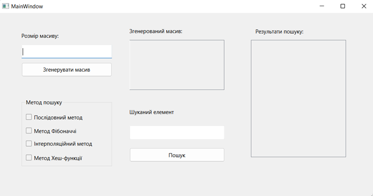
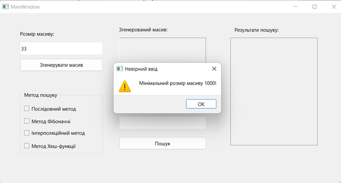
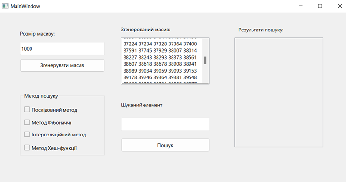
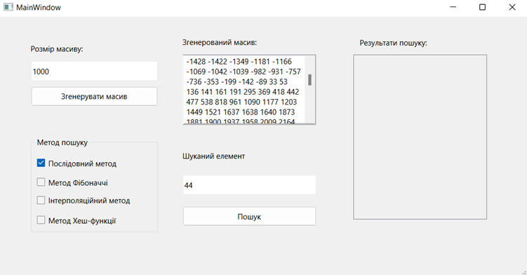
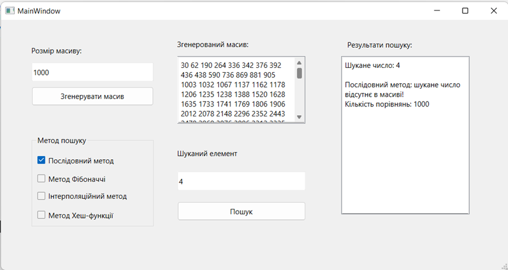
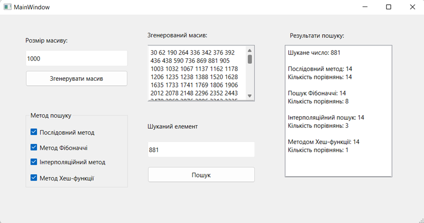

# Про проект: Пошук заданих елементів у масиві

## Мета

Метою роботи є розробка якісного програмного забезпечення, яке реалізує пошук заданих елементів у масиві, такими методами як, як послідовний метод, метод Фібоначчі, інтерполяційний метод та метод Хеш-функції.

У сучасному світі, де дані стають все більш об'ємними і складними, здатність швидко та ефективно знаходити необхідну інформацію є критично важливою. І саме тут алгоритми пошуку виявляються незамінними інструментами, що дозволяють нам здійснювати ефективний пошук у великих обсягах даних. Алгоритми пошуку – це математичні методи, розроблені для виявлення наявності певного об'єкту в заданій колекції даних і визначення його місцезнаходження. Вони дозволяють здійснювати пошук не тільки в масивах чисел, але й у текстових документах, базах даних, графах та інших структурах даних. Вивчення алгоритмів пошуку має велике значення не лише для розуміння основних принципів комп'ютерних наук, але і для їх практичного застосування. Ці алгоритми використовуються в різних сферах, таких як інформаційні системи, штучний інтелект, комп'ютерна графіка, біоінформатика та багато інших.

## Постановка задачі

Розробити програмне забезпечення, що буде виконувати пошук заданих елементів у масиві наступними методами:
1. Послідовний метод;
2. Метод Фібоначчі;
3. Інтерполяційний метод;
4. Метод Хеш-функції.
   
Вхідними даними є розмір масиву та елемент, який хоче знайти користувач. Для даної роботи генерується випадковим чином масив, який має заданий розмір не менше 1000 унікальних елементів. Програмне забезпечення повинно обробляти масив відповідно до обраного методу і шукати заданий елемент. 

Вихідними даними є порядковий номер елементу, який потрібно знайти. Якщо такий елемент не знайдено, то програма повинна вивести відповідне повідомлення.  

## Інструкція користувача

Після запуску виконавчого файлу відкривається головне вікно програми (рисунок 1).

Рисунок 1. Головне вікно програми

Далі користувачу необхідно ввести розмір бажаного масиву, причому мінімальне значення розміру має бути 1000, інакше користувач отримає помилку(рисунок 2).

Рисунок 2. Отримання помилки при введенні малого розміру масиву

Після коректного введення розміру та натиснення на кнопку «Згенерувати масив» у відповідному місці вікна виведеться відсортований масив з рандомних чисел(рисунок 3).

Рисунок 3. Виведення згенерованого масиву у відповідне  поле

Далі користувач має ввести елемент, який він хоче знайти, вибрати один або декілька методів для пошуку та натиснути кнопку «Пошук» (рисунок 4). Після цього у відповідному полі з’являться результати пошуку цього елементу у масиві, а саме: виведеться повідомлення, що такого елемента не знайдено, або ж виведеться порядковий номер цього елементу (рисунок 5). Після цього результати пошуку запишуться до файлу.

Рисунок 4. Вибір метода пошуку та введення шуканого елементу

Рисунок 5. Вивід результатів пошуку

## Висновки

У ході даної курсової роботи було розроблене програмне забезпечення з використанням інтерфейсу та принципів об'єктно-орієнтованого, для розв’язку задачі пошуку заданого елемента у масиві. 

Пошук – це процес знаходження серед елементів даного типу елемента з заданими властивостями. Було розглянуть чотири алгоритми, які виконують процес пошуку, а саме а саме: послідовний  метод, метод Фібоначчі, інтерполяційний метод та метод Хеш-функції. Послідовний метод полягає в послідовному перегляді всіх елементів і перевірці їх на відповідність ключу пошуку. Пошук за Фібоначчі – це метод пошуку, який використовується для відсортованих масивів, який звужує можливі місця розташування за допомогою чисел Фібоначчі. Інтерполяційний пошук полягає у знайденні оціночної позиції ключа та порівняння цієї позиції з шуканим значенням ключа. В основі методу пошуку за допомогою Хеш-Функції лежить використання хеш-таблиці.

За допомогою розробленої програми користувач може здійснити пошук елементу в випадково заданому масиві. Користувач вводить бажаний розмір масиву (не менше 1000) та натискає кнопку для генерування масиву, потім потрібно ввести шуканий ключ та обрати один або декілька методів пошуку. Після натиснення кнопки пошуку у відповідному полі з’являються результати пошуку для обраного методу та кількість порівнянь. 

